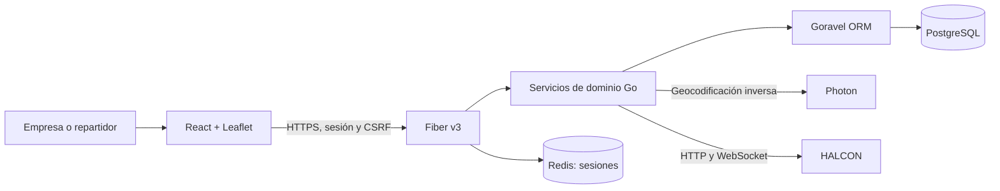
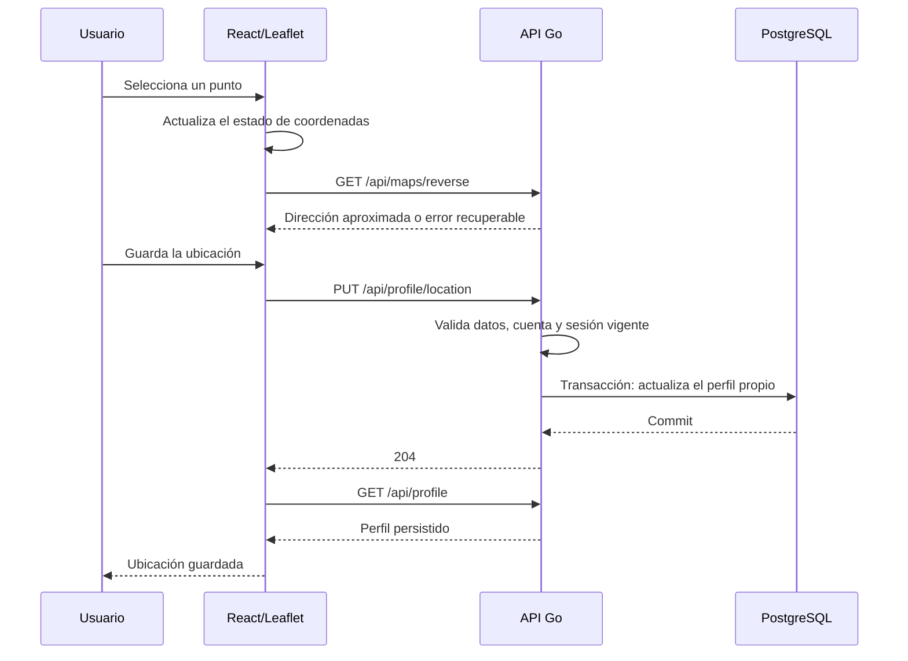

# CHITA: diseño, implementación y verificación

## Propósito y arquitectura

CHITA coordina entregas entre empresas y repartidores. HALCON es un sistema separado que proporciona el seguimiento durante trabajos activos. CHITA ofrece un cliente React adaptable para escritorio y móvil; no es una aplicación nativa ni garantiza localización con la pantalla bloqueada.

El frontend utiliza React 19, TypeScript, Vite y Leaflet 1.9.4. El backend utiliza Go, Fiber v3 y Goravel para arranque, configuración, ORM, transacciones y migraciones. La publicación actual pasa por Cloudflare Tunnel hacia el servicio de usuario `chita.service` en 127.0.0.1:3330.

- `react/src/main.tsx`: acceso, navegación, trabajos, redes, avisos, cuenta e integración HALCON.
- `react/src/Map.tsx`: mapas de trabajos, puntos de referencia y selección de ubicaciones.
- `react/src/ProfileLocation.tsx`: edición de la ubicación de la cuenta.
- `react/src/Dispatch.tsx`: disponibilidad, búsqueda cercana y propuestas.
- `react/src/RatingCard.tsx` y `AdminPanel.tsx`: calificaciones y administración.
- `app/http/controllers`: transporte HTTP, validación del formato y DTO públicos.
- `app/services`: permisos, reglas de negocio, transacciones y conexión con HALCON.
- `app/models`, `database/migrations`: persistencia y restricciones del esquema.
- `app/server`: sesiones, cabeceras, CSRF, límites y almacenamiento de sesiones.

## Cuentas y datos

El registro público permite empresa o repartidor. El rol es inmutable en los flujos públicos. Cada cuenta tiene su modelo de usuario y su perfil dedicado: empresa o repartidor, con dirección y coordenadas de referencia. La administración utiliza un rol separado creado mediante Artisan; no puede elegirse desde el registro.

Los trabajos guardan empresa, visibilidad, recogida, entrega, coordenadas, ventanas horarias, tarifa, moneda, estado y repartidor asignado. Las redes requieren invitación y aceptación. Las propuestas y calificaciones tienen tablas dedicadas, claves foráneas y restricciones de unicidad. Eventos, notificaciones y auditorías permiten conservar el historial. Archivar mantiene relaciones mediante eliminación lógica.

## Ubicación: interacción y persistencia

El editor de cuenta presenta un mapa abierto. La persona toca un punto, revisa la dirección aproximada y pulsa **Guardar ubicación**. También puede utilizar GPS, seleccionar el centro con teclado, corregir la dirección o descartar los cambios. Las coordenadas no requieren escritura manual.

Se corrigió un fallo real del editor anterior: los campos ocultos usaban `defaultValue`, y un render de React podía restaurar las coordenadas previas aunque la dirección nueva siguiera visible. Ahora el punto seleccionado forma parte del estado de React y los campos ocultos reciben valores controlados. La prueba exige que ambas coordenadas cambien, comprueba el cuerpo enviado, lee el perfil desde PostgreSQL y recarga la página.

El guardado espera la búsqueda de dirección y bloquea nuevas selecciones durante la escritura. Un error mantiene la selección para reintentar. Descartar devuelve el punto y la dirección persistidos. El servidor acepta sólo dirección, latitud y longitud: el cliente no puede indicar el usuario propietario, cambiar el rol ni asignarse permisos. La sesión se vuelve a comprobar dentro de la transacción para rechazar una petición que use un permiso ya revocado.

La dirección externa es aproximada y editable. Sólo las coordenadas se envían al proveedor; no el nombre de la cuenta. El proveedor configurable `GEOCODER_URL` tiene caché limitada y un máximo de una solicitud por segundo por proceso. Si falla, se permite escribir la dirección manualmente; no se inventa una dirección para ocultar el fallo.

## Contención de mapas y Firefox

Todos los tipos de mapa utilizan un marco con tamaño explícito, ancho máximo, `overflow: hidden`, aislamiento y `contain: layout paint`. Las capas y transformaciones de zoom quedan dentro de ese marco. Los elementos de las columnas admiten encogimiento y el mapa de cuenta tiene una altura relativa al viewport, con límites mínimos y máximos.

Los tres tipos de mapa observan cambios del contenedor y llaman a `invalidateSize({ pan: false })`. Esto incluye el mapa de recogida/entrega, que antes no observaba cambios de tamaño de su columna. Se conserva la navegación interna del mapa y sus controles de zoom.

La verificación cubre Firefox y Chrome, zoom positivo/negativo, desplazamiento con teclado, escala CSS de 125% y anchos de 390, 768, 800, 1024, 1440 y 1920. Comprueba geometría, recorte y que las capas no reciben eventos fuera del mapa. La escala CSS es una simulación de ampliación; no sustituye todas las combinaciones de zoom del navegador, GPU y pantalla física.

Referencias de implementación: [contención CSS](https://developer.mozilla.org/en-US/docs/Web/CSS/Reference/Properties/contain) y [actualización de tamaño en Leaflet](https://leafletjs.com/reference.html#map-invalidatesize).

## Trabajos y propuestas

La secuencia normal es `published → accepted → picked_up → arrived → delivery_reported → completed`. El repartidor informa de recogida, llegada y entrega; la empresa confirma. La empresa puede solicitar revisión, que devuelve el trabajo a `arrived`, o cancelar antes de la recogida. El servidor rechaza saltos y acciones de otro rol.

Un trabajo público está disponible para repartidores registrados; uno exclusivo exige pertenencia aceptada a la red. La asignación se protege mediante transacciones y bloqueo del trabajo: dos aceptaciones simultáneas no producen dos repartidores asignados.

La búsqueda cercana requiere disponibilidad voluntaria y reciente. Devuelve hasta 50 repartidores, ordenados por distancia en línea recta, con radio máximo de 50 km. Esta distancia no es un tiempo de viaje. Los repartidores con entregas pendientes no aparecen como disponibles. No se revelan correos, teléfonos ni credenciales en ese listado.

Una propuesta reserva el trabajo durante un máximo de dos minutos, o hasta el fin de recogida si ocurre antes. El destinatario puede aceptar o rechazar, y la empresa puede retirar. La reserva impide que otro repartidor acepte ese trabajo. La propuesta individual permite ver únicamente ese trabajo fuera de una red; no incorpora a la persona a la red. Hay como máximo una propuesta pendiente por trabajo y por repartidor. La caducidad se aplica en consultas y transacciones, sin depender de que el navegador mantenga un temporizador activo.

## Calificaciones y seguimiento

La empresa necesita al menos tres entregas completadas y confirmadas con ese repartidor. Aceptados, cancelados y pendientes de confirmación no cuentan. Se admite una calificación de 1 a 5 y un comentario por pareja empresa/repartidor. Actualizarla conserva una sola contribución al promedio. Las entregas confirmadas archivadas siguen contando.

La disponibilidad cercana y el seguimiento de HALCON son mecanismos diferentes. La disponibilidad envía GPS mientras la página está abierta, expira tras cinco minutos sin renovación y utiliza un identificador de consentimiento para evitar reactivación por mensajes atrasados. Se detiene al revocar disponibilidad, cerrar sesión o aceptar un trabajo.

HALCON utiliza una vinculación personal. CHITA guarda la sesión remota cifrada, con vencimiento máximo de 25 minutos, y transmite coordenadas mediante WebSocket. La empresa sólo accede al seguimiento de sus entregas activas. Desvinculación, cierre de sesión y cambios de estado cierran el envío según las reglas del dominio. El broker actual requiere una sola instancia de CHITA; varias réplicas exigirían coordinación distribuida.

## Diseño UX/UI

La cuenta separa identidad y mapa en escritorio y se apila en móvil. El editor utiliza un único mapa, con estados explícitos de selección, búsqueda, cambios pendientes, guardado y error. Seleccionar un trabajo en móvil desplaza y enfoca sus detalles; respeta movimiento reducido.

El estilo utiliza rojo y amarillo intensos sobre superficies blancas/negras. Los degradados y brillos resaltan acciones y bordes; el texto utiliza superficies legibles. Los tamaños son relativos y acotados. Hay navegación superior, menú móvil modal, cierre con Escape, etiquetas, foco visible y temas claro/oscuro. Axe detecta problemas automáticos de accesibilidad en los recorridos probados; no constituye una certificación de accesibilidad.

## Seguridad y alcance de las pruebas

Las sesiones utilizan Redis con espacio de nombres propio, cookies HttpOnly y SameSite; en producción son Secure y llevan prefijo `__Host-`. Los cambios requieren CSRF. Las respuestas API llevan `no-store`; CSP, restricciones de frames y permisos del navegador reducen la exposición. Hay límites de autenticación y de peticiones. Se corrigió una evasión comprobada de esos límites: Fiber tenía desactivada la validación de IP y trataba toda la cadena `X-Forwarded-For` como una clave diferente. Ahora valida las IP y recorre la cadena desde la derecha, con confianza limitada al proxy local. Un prefijo manipulado no cambia el visitante usado por el limitador. El test local reproduce la petición 21, que antes devolvía 422 en lugar de 429 y ahora es bloqueada. Véase el comportamiento de cabeceras de [Cloudflare](https://developers.cloudflare.com/fundamentals/reference/http-headers/#x-forwarded-for). Las contraseñas se almacenan con bcrypt. Los DTO excluyen hashes y sesiones de HALCON.

La propiedad de los recursos se resuelve en el servidor. Se prueban acceso entre empresas, recursos de otros repartidores, roles administrativos, campos desconocidos, coordenadas inválidas, aceptación simultánea, versiones de edición, sesiones revocadas y GPS sin consentimiento. Los textos del mapa se insertan con `textContent`, no como HTML del usuario.

La auditoría de dependencias detectó 30 avisos alcanzables antes de actualizar. Se actualizó Go de 1.26.0 a 1.26.8, PostgreSQL/pgx a 5.9.2, QUIC a 0.59.1 y gRPC a 1.83.2. La actualización del exportador de logs OpenTelemetry a 0.21 rompía la API utilizada por Goravel 1.18; se descartó antes de publicar. Se conserva 0.20 y se restringe el protocolo de logs a HTTP en la configuración, impidiendo seleccionar el exportador gRPC afectado. La telemetría no está habilitada en el despliegue actual. El aviso [GO-2026-6508](https://pkg.go.dev/vuln/GO-2026-6508) permanece como deuda de dependencia mitigada; requiere una actualización compatible de Goravel para eliminarlo. No equivale a un análisis sin avisos.

La administración registra actor y motivo en la misma transacción y utiliza versiones para impedir sobreescrituras simultáneas. No puede confirmar por la empresa ni cancelar después de recogida, y no tiene acceso global al GPS. El borrado lógico conserva historial; desactivar/restablecer cuentas revoca sesiones y vínculos según las reglas existentes.

La imagen Docker deja de copiar `.env` y excluye credenciales, respaldos y dependencias locales del contexto. Compila React en una etapa Node y lo incorpora junto al binario Go. Las variables privadas deben suministrarse al ejecutar el contenedor. El despliegue validado aquí utiliza systemd; no hay Docker instalado en este host y no se ejecutó una compilación de imagen.

Las pruebas destructivas se limitan a bases cuyo nombre termina en `_validation`. Las pruebas reales del navegador usan CHITA en 3340 y HALCON en 3331; producción se verifica con respuestas privadas controladas. Los mosaicos repetidos y algunas respuestas de geocodificación son fixtures para evitar cargas sobre proveedores comunitarios. La autenticación, los cambios de ubicación y los ciclos de trabajo reales se verifican por HTTP y PostgreSQL. Una consulta externa y capturas con mosaicos reales complementan esas comprobaciones.

Los resultados concretos están en [PRUEBAS_CHITA.md](PRUEBAS_CHITA.md). No se afirma que el sistema esté libre de todos los defectos. El GPS es una posición comunicada por el navegador, no una prueba de presencia física ni un mecanismo contra falsificación del dispositivo. No se han cubierto todas las versiones de Firefox, dispositivos físicos, GPU, uso offline, GPS con pantalla bloqueada ni cargas de 1000 usuarios en esta ronda. Pagos y notificaciones push permanecen fuera de esta versión.

## Rediseño por tareas, guías y perfiles (2 de octubre de 2026)

La empresa inicia en un centro de tareas: crear una entrega, encontrar repartidor y seguir entregas. El repartidor conserva el acceso inmediato a trabajos disponibles y puede abrir su centro de tareas desde Inicio. La navegación de escritorio es lateral; en móvil se mantiene el diálogo modal con cierre por Escape y control de foco. Al cambiar de sección, el contenido recibe el foco y vuelve al inicio. La publicación ocupa su propia sección; el borrador permanece montado durante la navegación de la sesión, pero no se promete conservarlo al cerrar o recargar el navegador. Lista y detalle se separan: sin selección no se ocupa media pantalla con un panel vacío.

Los filtros de trabajos operan sobre la página cargada y lo explican expresamente. Los resúmenes muestran página, cantidad cargada y total disponible, sin convertir contadores parciales en cifras globales. Buscar repartidores consulta posiciones compartidas voluntariamente y recientes; Directorio sirve para formar redes y no expresa disponibilidad ni expone coordenadas.

`DashboardHome.tsx`, `UsageGuide.tsx`, `CourierDirectory.tsx` y `ProfilePhoto.tsx` agrupan los flujos nuevos. La guía contiene pasos por rol y accesos directos; la landing explica creación de cuenta, publicaciones, propuestas, redes, fotos y límites del servicio. Rojo y amarillo intensos identifican acciones y marca sobre superficies claras y oscuras. Las transiciones son breves y se reducen con `prefers-reduced-motion`. Se mantienen foco visible, etiquetas, avisos accesibles y objetivos táctiles. Estas decisiones siguen las orientaciones de [reflow de WCAG](https://www.w3.org/WAI/WCAG22/Understanding/reflow.html) y [orden del foco](https://www.w3.org/WAI/WCAG22/Understanding/focus-order.html); las pruebas automáticas no constituyen una certificación completa ni sustituyen pruebas de usabilidad con personas.

### Directorio e invitaciones

`GET /api/couriers/directory` está reservado a empresas autenticadas. Busca nombres mediante parámetros SQL y escapa comodines; pagina 30 filas por página, ordenadas por nombre e ID. Sólo devuelve repartidores activos sin eliminación lógica, con nombre, foto, vehículo, media y cantidad de calificaciones y estado de afiliación respecto a la empresa actual. No devuelve correo, teléfono, dirección ni posición. `POST /api/network` acepta correo o `courier_id`, exclusivamente uno. Reutiliza el servicio transaccional existente y la aceptación del destinatario; conocer un ID no permite autoafiliarlo. Las calificaciones conservan el requisito de tres trabajos completados y confirmados para esa empresa.

### Fotos de perfil

Las respuestas tardías de guardado se descartan al cambiar de sesión; el cliente también comprueba el ID del usuario antes de actualizar su imagen. Los mapas descartan callbacks de tamaño pendientes tras desmontarse y ajustan el tamaño sin desplazar ni animar su posición. Publicar desde otra página restablece filtros y consulta explícitamente la primera página, para que el trabajo nuevo sea visible.

El cliente admite JPG/PNG/WebP de hasta 5 MB, recorta al centro y reduce a 128×128 antes de enviar un JPEG. `PUT /api/profile/avatar` sólo modifica el usuario de la sesión y su concesión vigente; rechaza campos ajenos y conserva CSRF y límite global HTTP de 32 KiB. El servidor limita los datos codificados y decodificados, comprueba dimensiones máximas de 256×256, decodifica raster y vuelve a codificar JPEG sin los metadatos originales. No permite SVG, rutas de archivos ni URLs remotas. La imagen pequeña se conserva como data URI en la columna `users.avatar_url`, ya existente, por lo que no se requieren migraciones ni almacenamiento público de originales. Se permite eliminar la foto explícitamente con cadena vacía. El directorio devuelve únicamente esta foto acotada; si en el futuro se necesitan imágenes grandes debe adoptarse almacenamiento específico con autorización y procesamiento, sin ampliar este mecanismo sin límites.
