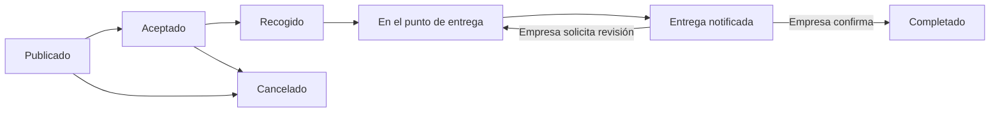

# CHITA

Primera versión funcional para coordinar entregas entre empresas y repartidores. Proyecto independiente de HALCON: backend Go 1.26, Goravel 1.18 y Fiber v3; cliente React 19 y TypeScript adaptable a escritorio y móvil.

## Qué permite

- Crear una cuenta de empresa o repartidor con dirección y coordenadas. Cada rol tiene su propio perfil; el rol no puede cambiarse desde una petición del cliente.
- La empresa invita por correo a un repartidor registrado. El repartidor acepta antes de ver sus publicaciones.
- Publicar trabajos con recogida, entrega, coordenadas, ventanas horarias y tarifa en centavos (USD, CUP o EUR).
- Un solo repartidor puede aceptar un trabajo. La asignación y los cambios de estado se protegen mediante transacciones y bloqueos de filas.
- Confirmar recogida, llegada y aviso de entrega. La empresa confirma el resultado o solicita revisión indicando el motivo.
- Consultar avisos dentro de CHITA. Retirar un repartidor de la red no elimina su acceso a trabajos ya aceptados.
- Compartir la ubicación mediante una cuenta personal de HALCON durante un trabajo activo. La empresa consulta la última posición autorizada, normalmente cada 2,5 segundos desde la interfaz.



La cancelación requiere motivo y sólo se permite antes de recoger. El seguimiento de CHITA está disponible en `accepted`, `picked_up` y `arrived`; se corta al notificar la entrega. Confirmación y coordenadas no constituyen una prueba física de entrega.

## Ejecutar

Requisitos: Go 1.26, Node compatible con Vite 8, PostgreSQL, Redis y HALCON accesible por su API y WebSocket.

```bash
cp .env.example .env
# Completar las credenciales de una base de datos exclusiva de CHITA.
go run . artisan key:generate
go run . artisan migrate
cd react
npm ci
npm run build
cd ..
go run .
```

Abrir `http://localhost:3330`. `APP_PORT` y `APP_HOST` se respetan. La aplicación sirve `react/dist` y la API en el mismo origen. Para desarrollo del cliente: `cd react && npm run dev`, puerto 5175, proxy de API al puerto 3330.

Usar `APP_ENV=production` y HTTPS para publicación: las cookies cambian a `__Host-chita-session` y `__Host-chita-csrf`, son Secure y HttpOnly. El servidor sólo confía en cabeceras de proxy procedentes de loopback; un proxy de publicación debe sobrescribir las cabeceras reenviadas. No habilitar CORS indiscriminadamente ni reutilizar credenciales o tablas de HALCON.

## Integración con HALCON

`HALCON_URL=http://127.0.0.1:3300` permite la comunicación interna cuando ambos servicios están en el mismo servidor. HTTP se acepta exclusivamente para loopback; para otro host se exige HTTPS. No se siguen redirecciones. Una URL pública protegida por un intermediario puede bloquear clientes WebSocket de servidor: preferir una ruta interna confiable.

El repartidor vincula su cuenta personal existente de HALCON desde **Mi cuenta**. CHITA:

1. Obtiene un token CSRF e inicia una sesión mediante las API oficiales existentes de HALCON.
2. Comprueba que la cuenta tenga rol `user` y halcón personal. No acepta cuentas de administración o moderación.
3. Guarda la sesión remota cifrada con la APP_KEY de CHITA y la asociación de identificadores. Nunca guarda la contraseña ni supone que los IDs de ambos sistemas coincidan. Una identidad de HALCON sólo puede vincularse a un repartidor de CHITA.
4. Mantiene una conexión WebSocket para enviar posiciones y filtra la respuesta de seguimiento para devolver exclusivamente el halcón personal vinculado.
5. Verifica en cada consulta que quien solicita la posición sea la empresa del trabajo o el repartidor asignado, y que el trabajo siga activo.

La sesión vinculada tiene un límite conservador de 25 minutos y puede renovarse desde la interfaz. La vinculación conserva el destinatario y los permisos de moderación de HALCON. Compartir desde CHITA puede sustituir otra conexión productora abierta con esa misma cuenta de HALCON. El broker cierra conexiones inactivas después de aproximadamente 45–55 segundos.

Redis usa claves `chita:session:` y cookies propias. Su operación de borrado global está deshabilitada. Las autorizaciones de sesión persistidas hacen definitivo el cierre de sesión incluso ante peticiones simultáneas que intenten guardar una copia antigua de la sesión.

Esta versión usa un broker de seguimiento dentro del proceso: ejecutar **una instancia** de CHITA. Distribuirlo entre varias instancias requerirá coordinar productores y desconexiones mediante un broker compartido.

## Web y móvil

El mismo cliente React funciona en ambos tamaños y tiene un manifiesto web para acceso desde el dispositivo. Los formularios permiten usar el GPS como referencia o seleccionar puntos en el mapa. Debe comprobarse que la dirección escrita corresponda a las coordenadas.

Es una versión **web móvil**, no un binario nativo Android/iOS. El navegador puede pausar el GPS al cambiar de aplicación o bloquear la pantalla. Para seguimiento se requieren permisos, contexto seguro (HTTPS salvo localhost), conectividad y la página abierta. No incluye modo sin conexión, pagos, geocodificación automática, notificaciones push, verificación de correo ni recuperación de contraseña. Estas funciones no se anuncian como disponibles.

Los mapas cargan imágenes de OpenStreetMap y requieren conexión con ese proveedor. Si los mapas no están disponibles, las direcciones y horarios siguen visibles. Para un despliegue de volumen hay que seleccionar un proveedor de mapas adecuado y revisar su política de uso y privacidad.

## Pruebas reproducibles

```bash
go test ./...
go vet ./...
cd react
npm test
npm run build
cd ..
```

Las pruebas HTTP reales son optativas y destructivas **sólo para su base de datos de pruebas**: requieren `CHITA_INTEGRATION=1` y un nombre de base de datos terminado en `_validation`. Truncan los usuarios de esa base; nunca usar una base con datos que deban conservarse.

```bash
# Preparar previamente chita_validation y aplicar sus migraciones.
CHITA_INTEGRATION=1 DB_HOST=127.0.0.1 DB_PORT=55439 \
DB_DATABASE=chita_validation DB_USERNAME=peter DB_PASSWORD='' \
go test -race ./app/server -v -count=1
```

Para incluir el contrato real de HALCON, iniciar una instancia de HALCON en `http://127.0.0.1:3331` con su propia base de datos de pruebas ya migrada y añadir `CHITA_HALCON_URL=http://127.0.0.1:3331` al comando. Esto crea cuentas de prueba exclusivamente en esa instancia.

```bash
CHITA_HALCON_URL=http://127.0.0.1:3331 go test ./app/services -v -count=1
# Con CHITA de pruebas escuchando en 3340 y el frontend construido:
cd react
npx playwright test
```

El ejecutable de Chromium en `react/playwright.config.ts` corresponde al entorno de desarrollo actual. Cambiarlo o usar `CHITA_CHROME_PATH` para otra instalación. Véase [PRUEBAS_CHITA.md](PRUEBAS_CHITA.md) para los resultados y [PLAN_CHITA.md](PLAN_CHITA.md) para las decisiones.

## Estructura

- `app/services`: cuentas, red, reglas de publicación, transiciones e integración HALCON.
- `app/http/controllers/delivery_controller.go`: API Fiber, autenticación y DTO que excluyen datos privados.
- `app/server`: sesiones, cabeceras, CSRF y pruebas de seguridad e integración.
- `app/models` y `database/migrations`: modelos y esquema Goravel. Los modelos heredados de reseñas, solicitudes e ítems todavía no tienen funcionalidades públicas en esta versión.
- `react`: cliente React compartido para escritorio y móvil, mapa, formularios y pruebas.

Referencias utilizadas: [ORM Goravel](https://www.goravel.dev/orm/getting-started.html), [sesiones Fiber v3](https://docs.gofiber.io/next/middleware/session/), [CSRF Fiber v3](https://docs.gofiber.io/next/middleware/csrf/), [efectos React](https://react.dev/reference/react/useEffect) y el código de las versiones fijadas en `go.mod` y `react/package-lock.json`.

Los mapas usan la URL oficial y una política de referencia que envía sólo el origen al proveedor. Se respeta la caché normal del navegador. Las pruebas repetidas de navegador usan imágenes de mapa controladas para no descargar mosaicos del servicio comunitario en cada ejecución. Política: https://operations.osmfoundation.org/policies/tiles/.

En este entorno se instaló un servicio de usuario `chita.service` para arranque **local** en 127.0.0.1:3330. Su plantilla está en `deploy/chita.service`. Se administra con `systemctl --user status|restart|stop chita.service`. HALCON continúa en su servicio separado. No hay publicación pública de CHITA configurada en esta entrega.
