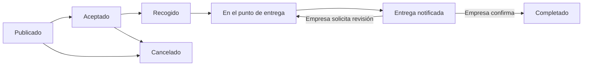

# CHITA

Primera versión funcional para coordinar entregas entre empresas y repartidores. Proyecto independiente de HALCON: backend Go 1.26, Goravel 1.18 y Fiber v3; cliente React 19 y TypeScript adaptable a escritorio y móvil.

## Qué permite

- Crear una cuenta de empresa o repartidor con dirección y coordenadas. Cada rol tiene su propio perfil; el rol no puede cambiarse desde una petición del cliente.
- La empresa elige trabajos públicos para todos los repartidores registrados o exclusivos de su red. Para los exclusivos, invita desde el directorio o por correo y el repartidor debe aceptar. Los trabajos existentes siguen siendo exclusivos.
- Consultar un directorio de repartidores con foto, vehículo y puntuaciones, e invitarles a la red sin conocer su correo. El directorio no muestra coordenadas ni implica disponibilidad.
- Personalizar la foto de perfil; el cliente la recorta y reduce y el servidor valida y vuelve a codificar la imagen.
- Usar paneles por tareas, guía de uso para cada rol y temas claro/oscuro con navegación móvil accesible.
- Publicar trabajos con recogida, entrega, coordenadas, ventanas horarias y tarifa en centavos (USD, CUP o EUR).
- Ordenar primero las entregas activas del repartidor y después las recogidas disponibles por cercanía, antes de paginar. Por defecto se usa la ubicación del perfil; «Ordenar cerca de mí» solicita GPS para actualizar el orden. Distancia en línea recta, no ruta ni tiempo de viaje.
- Un solo repartidor puede aceptar un trabajo. La asignación y los cambios de estado se protegen mediante transacciones y bloqueos de filas.
- Confirmar recogida, llegada y aviso de entrega. La empresa confirma el resultado o solicita revisión indicando el motivo.
- Consultar avisos dentro de CHITA. Retirar un repartidor de la red no elimina su acceso a trabajos ya aceptados.
- Compartir la ubicación mediante una cuenta personal de HALCON durante un trabajo activo. La empresa consulta la última posición autorizada, normalmente cada 2,5 segundos desde la interfaz.



La cancelación requiere motivo y sólo se permite antes de recoger. El seguimiento de CHITA está disponible en `accepted`, `picked_up` y `arrived`; se corta al notificar la entrega. Confirmación y coordenadas no constituyen una prueba física de entrega.

## Publicaciones y navegación

`POST /api/jobs` acepta `visibility: "network" | "public"`; omitirla conserva el comportamiento de red. El esquema valida esos dos valores. Los trabajos públicos sólo están disponibles mientras están publicados, no han vencido y su empresa sigue activa. Tras la aceptación, el acceso queda restringido a la empresa propietaria y al repartidor asignado. Ser público no abre el seguimiento GPS ni modifica los permisos de HALCON.

`GET /api/jobs?page=1&lat=23.1&lng=-82.3` acepta un par de coordenadas finitas en rango para ordenar la misma selección autorizada. Sin ese par se usa el perfil del repartidor. Tras prioridad y distancia se desempata por cierre de recogida y por ID. La API devuelve `visibility` y `pickup_distance_km`; no guarda el GPS solicitado para ranking.

La landing está en `/`, el acceso en `/entrar` y el registro en `/registro`, con enlaces de rol. La plataforma tiene navegación superior y menú lateral modal en móvil, tema claro/oscuro/sistema y logo propio. La landing explica visibilidad, cercanía, vinculación, permisos y límites reales.

## Ejecutar

Requisitos: Go 1.26.8 o posterior, Node compatible con Vite 8, PostgreSQL, Redis y HALCON accesible por su API y WebSocket.

```bash
cp .env.example .env
# Completar las credenciales de una base de datos exclusiva de CHITA.
./artisan key:generate
./artisan migrate
cd react
npm ci
npm run build
cd ..
go run .
```

Abrir `http://localhost:3330`. `APP_PORT` y `APP_HOST` se respetan. La aplicación sirve `react/dist` y la API en el mismo origen. Para desarrollo del cliente: `cd react && npm run dev`, puerto 5175, proxy de API al puerto 3330.

### Despliegue con Docker Compose

El stack Compose incluye PostgreSQL y Redis persistentes, y publica CHITA sólo en el loopback del host para que un proxy local (por ejemplo, Cloudflare Tunnel) lo exponga. No publica los puertos de la base de datos ni Redis. La instancia CHITA debe ser única porque el broker de ubicación vive en memoria. HALCON debe permanecer accesible en `HALCON_URL`. Compose reserva `172.30.77.0/24` con direcciones fijas y confía sólo en el gateway de esa red para leer `X-Forwarded-For`; si esa red ya está en uso, define un `CHITA_DOCKER_PREFIX` libre de tres octetos IPv4 en `.env`, por ejemplo `172.30.78`.

```bash
cp .env.example .env
# Generar APP_KEY con ./artisan key:generate. Editar .env para definir una
# contraseña DB_PASSWORD robusta y HALCON_URL alcanzable desde el contenedor.
docker compose build
docker compose run --rm chita artisan migrate
docker compose up -d chita
docker compose ps
curl -fsS -o /dev/null -w '%{http_code}\n' http://127.0.0.1:3330/healthz
```

El endpoint `/healthz` confirma que el proceso HTTP responde; no sustituye una comprobación de dependencias ni verifica que HALCON esté disponible. Antes de actualizar, toma una copia de PostgreSQL y revisa las migraciones. No ejecutes `migrate:fresh`, `migrate:refresh` ni `db:wipe` sobre datos que quieras conservar. Los volúmenes `chita_postgres` y `chita_redis` deben incluirse en la política de respaldo del servidor. Para usar otro puerto local, establece `CHITA_PORT` antes de ejecutar Compose y actualiza el origen del proxy.

Usar `APP_ENV=production` y HTTPS para publicación: las cookies cambian a `__Host-chita-session` y `__Host-chita-csrf`, son Secure y HttpOnly. Por defecto el servidor sólo confía en proxies de loopback; `TRUSTED_PROXY_IPS` permite añadir IP o CIDR explícitos. El proxy de publicación debe sobrescribir las cabeceras reenviadas y no se debe confiar una red privada completa. No habilitar CORS indiscriminadamente ni reutilizar credenciales o tablas de HALCON.

## Integración con HALCON

`HALCON_URL=http://127.0.0.1:3300` permite la comunicación interna cuando ambos servicios están en el mismo servidor. HTTP se acepta exclusivamente para loopback; para otro host se exige HTTPS. No se siguen redirecciones. Una URL pública protegida por un intermediario puede bloquear clientes WebSocket de servidor: preferir una ruta interna confiable.

El repartidor vincula su cuenta personal existente de HALCON desde **Vincular con HALCON** en el panel o **HALCON** en la navegación. CHITA:

1. Obtiene un token CSRF e inicia una sesión mediante las API oficiales existentes de HALCON.
2. Comprueba que la cuenta tenga rol `user` y halcón personal. No acepta cuentas de administración o moderación.
3. Guarda la sesión remota cifrada con la APP_KEY de CHITA y la asociación de identificadores. Nunca guarda la contraseña ni supone que los IDs de ambos sistemas coincidan. Una identidad de HALCON sólo puede vincularse a un repartidor de CHITA.
4. Mantiene una conexión WebSocket para enviar posiciones y filtra la respuesta de seguimiento para devolver exclusivamente el halcón personal vinculado.
5. Verifica en cada consulta que quien solicita la posición sea la empresa del trabajo o el repartidor asignado, y que el trabajo siga activo.

La sesión vinculada tiene un límite conservador de 25 minutos y puede renovarse desde la interfaz. La vinculación conserva el destinatario y los permisos de moderación de HALCON. Compartir desde CHITA puede sustituir otra conexión productora abierta con esa misma cuenta de HALCON. El broker cierra conexiones inactivas después de aproximadamente 45–55 segundos.

Redis usa claves `chita:session:` y cookies propias. Su operación de borrado global está deshabilitada. Las autorizaciones de sesión persistidas hacen definitivo el cierre de sesión incluso ante peticiones simultáneas que intenten guardar una copia antigua de la sesión.

Esta versión usa un broker de seguimiento dentro del proceso: ejecutar **una instancia** de CHITA. Distribuirlo entre varias instancias requerirá coordinar productores y desconexiones mediante un broker compartido.

## Web y móvil

El mismo cliente React funciona en ambos tamaños y tiene un manifiesto web para acceso desde el dispositivo. Los formularios permiten usar el GPS como referencia o seleccionar puntos en el mapa. Debe comprobarse que la dirección escrita corresponda a las coordenadas.

Es una versión **web móvil**, no un binario nativo Android/iOS. El navegador puede pausar el GPS al cambiar de aplicación o bloquear la pantalla. Para seguimiento se requieren permisos, contexto seguro (HTTPS salvo localhost), conectividad y la página abierta. No incluye modo sin conexión, pagos, geocodificación automática, notificaciones push, verificación de correo ni recuperación de contraseña. Estas funciones no se anuncian como disponibles.

Los mapas cargan imágenes de OpenStreetMap y requieren conexión con ese proveedor. Si los mapas no están disponibles, las direcciones y horarios siguen visibles. Para un despliegue de volumen hay que seleccionar un proveedor de mapas adecuado y revisar su política de uso y privacidad.

## Pruebas reproducibles

```bash
go test ./...
go vet ./...
cd react
npm test
npm run build
cd ..
```

Las pruebas HTTP reales son optativas y destructivas **sólo para su base de datos de pruebas**: requieren `CHITA_INTEGRATION=1` y un nombre de base de datos terminado en `_validation`. Truncan los usuarios de esa base; nunca usar una base con datos que deban conservarse.

```bash
# Preparar previamente chita_validation y aplicar sus migraciones.
CHITA_INTEGRATION=1 DB_HOST=127.0.0.1 DB_PORT=55439 \
DB_DATABASE=chita_validation DB_USERNAME=peter DB_PASSWORD='' \
go test -race ./app/server -v -count=1
```

Para incluir el contrato real de HALCON, iniciar una instancia de HALCON en `http://127.0.0.1:3331` con su propia base de datos de pruebas ya migrada y añadir `CHITA_HALCON_URL=http://127.0.0.1:3331` al comando. Esto crea cuentas de prueba exclusivamente en esa instancia.

```bash
CHITA_HALCON_URL=http://127.0.0.1:3331 go test ./app/services -v -count=1
# Con CHITA de pruebas escuchando en 3340 y el frontend construido:
cd react
npx playwright test
```

El ejecutable de Chromium en `react/playwright.config.ts` corresponde al entorno de desarrollo actual. Cambiarlo o usar `CHITA_CHROME_PATH` para otra instalación. Véase [PRUEBAS_CHITA.md](PRUEBAS_CHITA.md) para los resultados y [PLAN_CHITA.md](PLAN_CHITA.md) para las decisiones.

## Estructura

- `app/services`: cuentas, red, reglas de publicación, transiciones e integración HALCON.
- `app/http/controllers/delivery_controller.go`: API Fiber, autenticación y DTO que excluyen datos privados.
- `app/server`: sesiones, cabeceras, CSRF y pruebas de seguridad e integración.
- `app/models` y `database/migrations`: modelos y esquema Goravel. Los modelos heredados de reseñas, solicitudes e ítems todavía no tienen funcionalidades públicas en esta versión.
- `react`: cliente React compartido para escritorio y móvil, mapa, formularios y pruebas.

Referencias utilizadas: [ORM Goravel](https://www.goravel.dev/orm/getting-started.html), [sesiones Fiber v3](https://docs.gofiber.io/next/middleware/session/), [CSRF Fiber v3](https://docs.gofiber.io/next/middleware/csrf/), [efectos React](https://react.dev/reference/react/useEffect) y el código de las versiones fijadas en `go.mod` y `react/package-lock.json`.

Los mapas usan la URL oficial y una política de referencia que envía sólo el origen al proveedor. Se respeta la caché normal del navegador. Las pruebas repetidas de navegador usan imágenes de mapa controladas para no descargar mosaicos del servicio comunitario en cada ejecución. Política: https://operations.osmfoundation.org/policies/tiles/.

En este entorno se instaló un servicio de usuario `chita.service` para arranque **local** en 127.0.0.1:3330. Su plantilla está en `deploy/chita.service`. Se administra con `systemctl --user status|restart|stop chita.service`. HALCON continúa en su servicio separado. CHITA está publicado en https://chita.duohnson.com mediante el túnel Cloudflare configurado en el servidor.

### Administración

El rol `admin` es independiente de empresa y repartidor. El registro público no permite elegirlo ni convertir cuentas existentes. Para crear la primera cuenta desde el servidor:

```bash
cd /home/peter/CHITA
./artisan admin:create --email tu-correo --name "Administrador"
```

El comando solicita y confirma la contraseña sin mostrarla. También admite `--password-file` con un archivo regular privado (0600). No pases contraseñas como argumentos. Entra desde `/entrar` para abrir el panel; la sección Seguridad permite cambiar la contraseña y cierra todas las sesiones.

El panel contiene resumen, trabajos, empresas, repartidores, historial y seguridad, con navegación móvil, búsqueda, filtros, paginación y formularios de creación/edición. Cada cambio requiere un motivo y se registra en `admin_audits` dentro de la misma transacción. Las versiones impiden sobrescribir un cambio simultáneo.

- Las empresas y repartidores se crean con cuentas y perfiles dedicados. El rol y los identificadores son inmutables. Desactivar o restablecer la contraseña invalida las sesiones y desvincula HALCON.
- Archivar es una eliminación lógica: mantiene las relaciones y el historial. Las cuentas restauradas quedan desactivadas; deben activarse explícitamente. Las invitaciones revocadas requieren nuevo consentimiento. Un correo reutilizado impide restaurar la cuenta original hasta resolver el conflicto.
- No se pueden desactivar cuentas con entregas pendientes ni archivar una empresa con publicaciones abiertas. Los trabajos aceptados conservan tarifa, horarios y recorrido. Administración sólo puede cancelar antes de la recogida; la confirmación de entrega corresponde a la empresa.
- El panel no concede acceso al GPS de repartidores: se mantienen los permisos específicos de cada entrega. No se devuelven hashes ni credenciales de HALCON. El historial administrativo es de sólo lectura en la API.
- La migración administrativa se niega a revertir si existen administradores o registros de auditoría, para evitar perder permisos e historial.

Pruebas del panel (sólo sobre una base cuyo nombre termine en `_validation`, con migraciones aplicadas):

```bash
CHITA_INTEGRATION=1 DB_HOST=127.0.0.1 DB_PORT=55439 DB_DATABASE=chita_validation DB_USERNAME=peter DB_PASSWORD='' go test -race ./app/server -count=1
```

`react/e2e/admin.spec.ts` verifica ambos temas, navegación móvil, accesibilidad y CRUD real. La prueba real exige `CHITA_ADMIN_BROWSER=1`, el servidor aislado en el puerto 3340 y una cuenta ficticia `admin-browser@chita.test` con la contraseña de prueba indicada en ese archivo. Nunca crees esa cuenta en producción. Las demás pruebas de apariencia usan respuestas simuladas y no modifican datos.

### Mapas, propuestas y calificaciones

Los formularios de registro, perfil, trabajos y administración permiten elegir puntos en el mapa. El punto rellena latitud y longitud y solicita una dirección aproximada, que siempre puede corregirse manualmente. Los recorridos y direcciones guardados se muestran también en mapas. La dirección sugerida no sustituye las indicaciones de acceso del destinatario.

La geocodificación inversa usa `GEOCODER_URL` (por defecto `https://photon.komoot.io`). Sólo envía coordenadas, limita las consultas a una por segundo por proceso y mantiene hasta 512 resultados durante 24 horas. Si el proveedor falla o limita las consultas, las coordenadas se conservan y se puede escribir la dirección. Para mayor tráfico, configura una instancia propia de [Photon](https://github.com/komoot/photon); su servidor público no garantiza disponibilidad. No se usa el servicio público de Nominatim para el seguimiento.

El repartidor activa voluntariamente su disponibilidad. Mientras la app está abierta, envía su posición cada 30 segundos. La visibilidad caduca después de cinco minutos sin actualización y termina al detenerla, cerrar sesión o aceptar un trabajo. Un identificador de consentimiento evita que una actualización retrasada reactive una disponibilidad detenida. El navegador puede suspender la localización en segundo plano; este mecanismo no garantiza seguimiento con la app cerrada. HALCON sigue siendo la integración separada de seguimiento de entregas.

Las empresas pueden buscar repartidores disponibles en un radio máximo de 50 km. Se ordenan por distancia y no se revelan correos, teléfonos ni credenciales. Una propuesta reserva un trabajo publicado durante un máximo de dos minutos (o hasta el fin de recogida, si ocurre antes). El repartidor puede aceptar o rechazar; la empresa puede retirarla. Mientras esté vigente, otro repartidor no puede aceptar ese trabajo. Una propuesta individual permite ver ese trabajo fuera de una red sin incorporar al repartidor a la red.

Una empresa sólo puede calificar a un repartidor después de tres entregas completadas y confirmadas por esa misma empresa. Los trabajos aceptados, cancelados o pendientes de confirmación no cuentan. La puntuación admite de una a cinco estrellas y un comentario; cada empresa tiene una calificación por repartidor, que puede actualizar sin aumentar artificialmente el promedio. El historial archivado conserva las entregas confirmadas.

`app/server/dispatch_integration_test.go` comprueba permisos, caducidad, consentimiento, reservas simultáneas y calificaciones. `react/e2e/location_dispatch.spec.ts` prueba mapas, respuestas atrasadas, ambos temas y pantallas móviles; su flujo real de tres entregas requiere `CHITA_REAL_DISPATCH=1` y el servidor aislado en 3340. No habilites pruebas reales sobre producción.

#### Carga con 1000 usuarios simulados

La prueba `app/server/load_integration_test.go` es destructiva para `users` y sus relaciones: sólo se ejecuta con `CHITA_LOAD=1`, `CHITA_INTEGRATION=1`, PostgreSQL en una IP de loopback y una base terminada en `_validation`. Levanta Fiber en un puerto efímero local. Genera 500 empresas y 500 repartidores, ejecuta invitaciones, permisos entre cuentas, tres entregas confirmadas y una calificación por pareja; luego emite tres lecturas autenticadas por cada una de las 1000 cuentas de forma concurrente. Usa 20 trabajadores durante registro/entregas y direcciones loopback distintas para respetar los límites por IP. No dirige tráfico al dominio público ni representa 1000 escrituras simultáneas.

```bash
CHITA_LOAD=1 CHITA_INTEGRATION=1 DB_HOST=127.0.0.1 DB_PORT=55439 \
DB_DATABASE=chita_validation DB_USERNAME=peter DB_PASSWORD='' \
go test ./app/server -run '^TestLoadOneThousandUsers$' -count=1 -v
```

### Revisión de mapas y pruebas en Firefox

El diseño y las reglas del sistema están descritos en [DISENO_IMPLEMENTACION_CHITA.md](DISENO_IMPLEMENTACION_CHITA.md). El editor mantiene las coordenadas seleccionadas en estado de React y las persiste únicamente al pulsar Guardar. Todos los mapas utilizan un marco de contención para sus capas y observan cambios de tamaño.

Para reproducir la suite en Firefox, instalar previamente su navegador de Playwright (`cd react` y `npx playwright install firefox`) y ejecutar `CHITA_BROWSER=firefox npm run test:e2e`. Sin indicadores adicionales, los escenarios de escritura real de admin, propuestas y perfiles se omiten; los flujos antiguos de trabajos de `workflow.spec.ts` sí requieren el servidor de pruebas. Nunca ejecutar la suite completa contra producción. Para la verificación real local, añadir `CHITA_ADMIN_BROWSER=1 CHITA_REAL_DISPATCH=1` con CHITA aislado en 3340 y el administrador ficticio descrito antes.

`react/e2e/map_regression.spec.ts` prueba zoom, desplazamiento, redimensionado, contención y guardado/recarga. `CHITA_BROWSER` sólo cambia el motor de pruebas, no el comportamiento de la aplicación.
